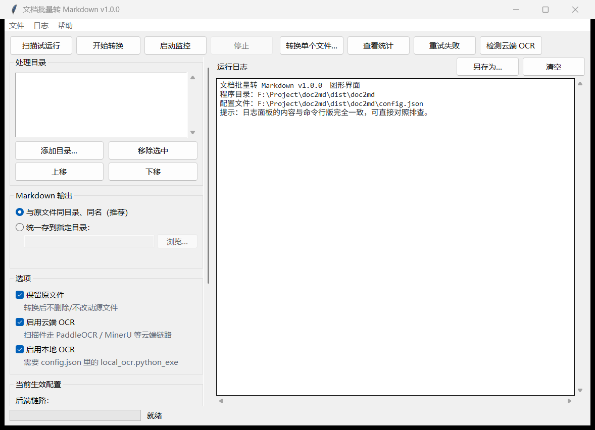

# doc2md · 文档批量转 Markdown

把一整个目录树的 **docx / doc / xls / xlsx / pdf** 批量转成 Markdown，并带上
**断点续传**、**实时监控**、**扫描件 OCR（多云端后端自动熔断切换）** 三件事。

为中文公文归档场景做的：段落重组、页码过滤、标题识别、落款分行、表格还原、
敏感目录不上云。

```
┌── 本地直转（不联网、最快） ────────────────────────────────┐
│  .docx  → mammoth        .xlsx → openpyxl                 │
│  .doc   → Office COM     .xls  → Office COM               │
│  有文本层 PDF → pymupdf4llm（带可信度复核，防"假文本层"）  │
└───────────────────────────────────────────────────────────┘
┌── 扫描件 / 无文本层 PDF → OCR ─────────────────────────────┐
│  1. paddle          PaddleOCR-VL      专用、出插图         │
│  2. mineru[精度]    MinerU precision  专用、出插图、可分段 │
│  3. sf-deepseek-ocr DeepSeek-OCR      专用、一问一答无队列 │
│  4. mineru[轻量]    MinerU agent      免 Token 兜底        │
│  任一层配额用尽 / 背压 / 鉴权失败 → 熔断该后端并自动切换   │
└───────────────────────────────────────────────────────────┘
```

---

## 快速开始

```bat
:: 1) 建虚拟环境（一次即可）
python -m venv .venv
.venv\Scripts\python.exe -m pip install -r requirements.txt

:: 2) 生成配置文件，然后把 roots 改成你的语料目录
copy config.example.json config.json

:: 3) 填云端 OCR 凭据（不填也能跑，只是扫描件没有云端后端）
copy .env.example .env

:: 4) 试运行：看清每个文件会走哪条通道，不写任何文件
.venv\Scripts\python.exe -m doc2md scan

:: 5) 正式转换 / 常驻监控
.venv\Scripts\python.exe -m doc2md run
.venv\Scripts\python.exe -m doc2md watch
```

不想敲命令就**双击 `文档转MD.bat`**，它带一个中文菜单（扫描 / 转换 / 监控 /
统计 / 重试 / 检测云端 OCR / 打开配置 / 打开凭据）。`云端OCR自检.bat` 专门做
后端连通性 + 凭据生效情况自检。

**想要窗口界面就双击 `文档转MD-GUI.bat`**，或者在上面的菜单里按 `G`。图形界面
与命令行共用同一套核心，功能完全一样 —— 详见 [图形界面（GUI）](#图形界面gui)。

`_python.bat` 是给上面几个 bat 共用的解释器探测脚本，**不要单独双击**。
查找顺序：`%DOC2MD_PYTHON%` → `.venv\Scripts\python.exe` → `venv\Scripts\python.exe`
→ PATH 上第一个真能跑的 `python`（微软商店那个占位程序会被识别并跳过）。

---

## 目录结构

```
doc2md/
├── doc2md/                 # 主程序包
│   ├── cli.py              #   命令行入口与各子命令
│   ├── engine.py           #   调度核心：计划、路由、断点续传、md 落盘
│   ├── converters.py       #   本地格式转换 + Markdown 清洗与段落重组
│   ├── detect.py           #   真实格式嗅探 + PDF 文本层可信度判定
│   ├── ocr_router.py       #   多后端路由器：优先级链路 + 熔断切换
│   ├── ocr.py              #   PaddleOCR 客户端 + 错误分类
│   ├── mineru.py           #   MinerU 客户端（precision / agent 两种模式）
│   ├── vlm.py              #   通用 OpenAI 兼容视觉模型客户端（接专用 OCR 模型）
│   ├── local_ocr.py        #   本地 RapidOCR 子进程客户端（可选）
│   ├── com.py              #   Office COM 转换（.doc/.xls）
│   ├── watcher.py          #   实时监控模式
│   ├── config.py           #   配置加载 + .env 凭据注入
│   └── state.py            #   SQLite 状态库（断点续传的依据）
├── tests/                  # 回归 / 集成测试
├── scripts/                # 运维脚本（清理、体检、隔离，默认 dry-run）
├── devkit.py               # 开发辅助：从 config.json 的 roots 自动挑样例
├── gui.py                  # 图形界面（Tkinter，零新增依赖）
├── launcher.py             # 菜单式启动器（被 文档转MD.bat 调用）
├── app.py                  # 统一入口：带参数走命令行、无参数进菜单或图形界面
├── doc2md.spec             # PyInstaller 打包配置（一份 Analysis 造两个 exe）
├── 打包EXE.bat             # 双击生成 dist\doc2md\doc2md.exe 与 doc2md-gui.exe
├── 文档转MD-GUI.bat        # 双击打开图形界面
├── config.example.json     # 配置模板（提交进仓库；真正的 config.json 被忽略）
├── .env.example            # 凭据模板（同上）
└── requirements.txt
```

> `.venv` 与 `.venv-gui` 都是本地环境、都不进版本库。前者是主环境；
> 后者只在**跑/打包图形界面**时需要，原因见 [图形界面（GUI）](#图形界面gui)。

---

## 命令行

| 命令 | 作用 |
|---|---|
| `python -m doc2md scan` | 试运行：列出待转文件与各自通道，**不写任何文件** |
| `python -m doc2md run` | 批量转换，中断后重跑自动续传 |
| `python -m doc2md watch` | 常驻监控新增/修改的文件并自动转换 |
| `python -m doc2md test <文件>` | 只转一个文件 |
| `python -m doc2md status` | 统计（含各后端今日用量） |
| `python -m doc2md retry` | 重试失败的文件（`--clear` 仅清记录） |
| `python -m doc2md ping` | 检测各云端 OCR 后端的就绪与连通性 |
| `python -m doc2md env` | 查看 `.env` 与各后端 Token 的生效情况 |

公共参数：`--config <路径>`、`--root <目录>`（可重复，覆盖配置）、
`--limit N`、`--quiet`、`--no-ocr`。写在子命令前后都认。

---

## 图形界面（GUI）



左边是配置（处理目录 / 输出方式 / 各项开关 / 当前生效配置，内容多时可滚动），
右边是实时日志（按错误、警告、成功着色），底部是进度条。

四种打开方式，随便挑一个：

```bat
:: 1) 双击（推荐）
文档转MD-GUI.bat
:: 2) 菜单版里按 G
文档转MD.bat  →  G
:: 3) 直接用解释器跑
.venv-gui\Scripts\python.exe gui.py
:: 4) 打包后的窗口版 exe
dist\doc2md\doc2md-gui.exe
```

界面上能做的事和命令行**一一对应**，因为它就是把这些调用搬进了窗口，
没有第二套实现：

| 界面上的按钮 | 等价命令 |
|---|---|
| 扫描试运行 | `scan` |
| 开始转换 | `run` |
| 启动监控 | `watch` |
| 转换单个文件… | `test <文件>` |
| 查看统计 | `status` |
| 重试失败 | `retry` |
| 检测云端 OCR | `ping` + 凭据自检 |

左侧的**处理目录 / 输出方式 / 保留原文件 / 云端 OCR / 本地 OCR** 改动会直接
写回 `config.json`（原子替换，`_xxx说明` 注释与多后端链路配置原样保留），
所以界面上看到的就一定是你实际在用的配置，不会出现"界面改了但程序没改"。

**日志面板与命令行输出完全一致**，可直接对照排查；`运行日志 → 另存为` 能把
整段日志存成 txt。

### 关于 `.venv-gui`：为什么需要第二个环境

图形界面用 **Tkinter**（Python 标准库，零新增依赖），但 **tkinter 不是纯 Python**——
它要 `_tkinter.pyd` + `tcl86t.dll` / `tk86t.dll` + tcl 脚本目录。

本机 WorkBuddy 托管的 Python 3.13 是**精简版**，这些文件一个都没有：

```
Lib/tkinter/__init__.py   →  不存在
DLLs/_tkinter.pyd         →  不存在
```

所以 `.venv` 里跑 GUI 会直接 `ModuleNotFoundError: No module named 'tkinter'`。
`.venv-gui` 是从本机另一套**完整 CPython 3.11.15**（uv 管理的，自带 tkinter、
Tk 8.6）建的，专供图形界面与打包使用：

```bat
:: 一次即可（约几分钟，取决于网速）
python -m venv .venv-gui
.venv-gui\Scripts\python.exe -m pip install -r requirements.txt
```

没建也不会出事：`文档转MD-GUI.bat` 会挑不到解释器并给出上面这两行命令，
菜单里的 `G` 也会明确提示"当前解释器没有 tkinter"。

### 「停止」按钮的确切语义

- **监控模式**：立即停止，`WatchService` 退出，监控句柄释放。
- **批量转换 / 重试**：**当前正在转换的那个文件会做完**，其余任务不再开始 ——
  不会留下半个 md。已完成的文件已经入库，所以再点一次「开始转换」会自动跳过它们，
  从中断处继续。这是刻意的：中途硬杀线程会让 Office COM 进程和云端任务悬空。

---

## 配置要点

配置全在 `config.json`（字段都带 `_xxx说明` 注释）。最常改的几个：

| 字段 | 说明 |
|---|---|
| `roots` | **要转换的目录列表**，必须改，空列表等于什么都不转 |
| `output.mode` | `alongside` 与源文件同目录同名（默认）；`custom` 统一存到 `output.root` |
| `output.layout` | custom 模式下 `mirror` 保留原目录结构 / `flat` 全部平铺 |
| `output.on_collision` | 两个源文件抢同一个 md 名时怎么办，见下 |
| `overwrite_existing_md` | `overwrite`（默认）比源文件旧就重写 / `skip` 只在缺失时生成 |
| `sensitive_markers` | 命中这些目录名的文件**禁止上传云端** |
| `pdf_trust_check` | 复核文本层是否真的可信（防"扫描件自带 OCR 层 / CID 乱码 / 隐形层"） |
| `local_ocr.python_exe` | 本地 RapidOCR 环境；**留空即自动禁用本地 OCR** |

### 关于 `on_collision`（同名冲突）

`x.docx` 与 `x.pdf` 是同一份公文的两种格式时会算出同一个 `x.md`。

- **`stable`（默认）** —— 先到先得 + 归属粘住：谁先拿到哪个名字就永久不变，
  重转只覆盖自己那一份，**绝不改名、绝不多冒第三个文件**，内容一个字不丢。
- `overwrite` —— 一个名字只剩一个文件。代价：同一文档两种格式内容不同时会丢一半。
- `suffix` —— 旧行为，每次重转重新抢，名字会漂移。**不建议**。

---

## 云端 OCR 多后端链路

链路在 `config.json` 的 `ocr.backends` 里，按 `priority` 从小到大尝试。
每家后端带独立熔断器（`closed → open → half_open`），冷却时间随失败次数翻倍，
半开时只放一个探测请求。

故障分类决定"熔断 + 切换"还是"直接快速失败"：

| 错误类型 | 熔断该后端 | 切换下一后端 |
|---|---|---|
| 配额用尽 / 鉴权失败 / 背压耗尽 / 网络不可达 | 是 | 是 |
| 能力不足（超页数、超体积、格式不支持） | 否 | 是 |
| 文档本身损坏 | 否 | 否 |
| 空结果 | 否 | 是 |

**只接 OCR 专用服务，不掺通用视觉对话模型。** 通用 VLM 不做逐字复现：密排小字
（发文号、日期、条款编号）在视觉 token 压缩后容易丢或错，还会出现数字幻觉 ——
把〔2024〕15 号读成 13 号这种错误在 md 里看不出任何异常，归档后极难发现。
要往链路上加后端，先确认它是**专用 OCR 模型**且**支持 PDF 或逐页图片输入**。

凭据统一放 `.env`，取值优先级：**系统环境变量 > `.env` > `config.json`**。
跨厂商后端**不继承**彼此的 Token 与服务地址（这条踩过坑：Paddle 的 Token 被
继承给 MinerU 轻量接口 → 401 → 该后端被永久熔断，备用通道形同虚设）。

---

## 开发与测试

```bat
:: 策略测试：151 项断言，假后端，不联网、不耗配额
.venv\Scripts\python.exe tests\test_ocr_router.py

:: 输出命名策略端到端（需要一个真实 docx + xlsx 做样本）
.venv\Scripts\python.exe tests\test_output_naming.py

:: 全链路冒烟：故意把链路首端设成坏后端，验证熔断切换（联网、会消耗 MinerU 额度）
.venv\Scripts\python.exe tests\test_engine_smoke.py
```

测试脚本**不写死任何语料路径**：样例由 `devkit.py` 从 `config.json` 的 `roots`
里自动挑（冒烟测试还会用引擎同一套判定筛出"真的会走 OCR"的 PDF）。找不到样例
时打印 `[跳过]` 并以退出码 2 结束，不会误报失败。也可以用环境变量固定样本：
`DOC2MD_SAMPLE_DOCX`、`DOC2MD_SAMPLE_XLSX`、`DOC2MD_SMOKE_PDFS`、
`DOC2MD_MINERU_PDFS`（多路径用 `os.pathsep` 分隔）。

`scripts/` 下的运维脚本**默认 dry-run，只打印不动作**，确认无误再加 `--apply`
或 `--move`；涉及删除的一律先移到隔离目录而不是直接删。

---

## 打包成 Windows EXE

目标机器不想装 Python 时，把程序打成独立可执行文件：

```bat
:: 双击 打包EXE.bat 即可；等价命令是：
.venv-gui\Scripts\python.exe -m pip install pyinstaller
.venv-gui\Scripts\python.exe -m PyInstaller doc2md.spec --noconfirm
```

产物在 `dist\doc2md\`，里面有**两个** exe：

| 产物 | 双击后 | 用途 |
|---|---|---|
| `doc2md.exe` | 中文控制台菜单 | 原来那套；带参数时等价于 `python -m doc2md <参数>` |
| `doc2md-gui.exe` | 图形界面 | 窗口版；`--menu` 可强制走菜单 |

两者**共享同一个 `_internal\` 目录** —— 一份 `Analysis`/`PYZ` 造两个 `EXE` 对象
再一起 `COLLECT`，所以多带一个窗口版只多几 MB，不是把 130 多 MB 再复制一份。
各自的显式开关：`doc2md.exe --gui` 走界面，`doc2md-gui.exe --menu` 走菜单。

> **必须用带 tkinter 的解释器打包。** PyInstaller 只能打包**构建解释器实际拥有**的
> 东西；用精简版 Python 3.13 打包，`tkinter` 根本不会被打进去，而**打包时不会报错**，
> 只在用户双击 `doc2md-gui.exe` 时才崩。所以 `doc2md.spec` 开头加了一道前置自检，
> 没有 tkinter 就直接中止并提示改用 `.venv-gui`；`打包EXE.bat` 也会优先挑 `.venv-gui`。

### 分发时的目录约定

- **整个 `dist\doc2md` 文件夹一起拷**，不能只拷 exe —— 依赖都在 `_internal\` 里。
- `config.json` / `.env` 放在 exe **旁边**；首次运行会自动生成配置模板。
- 程序根目录按 **exe 所在位置**解析，所以 `state.db`（断点续传依据）和 `logs\`
  都落在 exe 旁边、跟着程序走，**不会**像解包目录那样一退出就丢。
- 两个 exe 读同一份 `config.json` / `.env` / `state.db`，混用不会串味。
- `config.json` 里的 `state_db`、`log_dir`、`roots`、`local_ocr.python_exe`
  若写了绝对路径，换机器时要相应修改。

### 打不进去的两件事（能力边界，不是缺陷）

| 能力 | 原因 |
|---|---|
| `.doc` / `.xls` / `.wps` / `.et` | 走本机 WPS/Office 的 COM，**目标机必须装 Office 或 WPS** |
| 本地 RapidOCR | 需要另一套装了 `rapidocr` + `onnxruntime` 的解释器，用 `local_ocr.python_exe` 指过去 |

云端 OCR 链路（paddle / mineru / siliconflow）不受影响，Token 照旧放 `.env`。

### 体积

实测（PyInstaller 6.22 / Python 3.11 / onedir）：**约 155 MB、约 1030 个文件**，
其中两个 exe 各约 11 MB，其余全在 `_internal\`：

| 内容 | 体积 | 说明 |
|---|---|---|
| `pymupdf` | 38 MB | PDF 渲染与文本层抽取，必需 |
| `onnxruntime` | 36 MB | 只有 `pdf_use_layout=true`（ONNX 版面模型）才用得到 |
| `numpy`（含 `numpy.libs`） | 27 MB | 同上，是 onnxruntime 的依赖 |
| `libcrypto` / `libssl` | 9 MB | `requests` 的 TLS，云端 OCR 必需 |
| tkinter 运行时 | 8 MB | `_tkinter.pyd` + `tcl86t`/`tk86t` + tcl/tk 数据，**文件数的大头是这里的 830 个小文件** |
| 其余 | 约 37 MB | `python311.dll`、`pywin32`、`sqlite3` 等 |

窗口版只多占几 MB —— 两个 exe **共享同一个 `_internal\`**，不是把 155 MB 复制一份。

**想更小**：在 `doc2md.spec` 的 `excludes` 里加上 `onnxruntime`、`numpy`、`pymupdf_layout`，
可再省约 **63 MB**（155 → 92 MB）。代价是 `pdf_use_layout=true` 不再可用；
该选项默认关闭、本项目配置也一直是关的，所以日常使用不受影响。

> 这个体积是上一轮实测的历史数据；换成完整 Python 后因为多了 tcl/tk、
> `numpy`/`onnxruntime` 等，数字会略变，以实际构建为准。

想更小可在 `doc2md.spec` 的 `excludes` 里加上 `onnxruntime` 与 `numpy`
（约省 60 MB），代价是 `pdf_use_layout=true`（ONNX 版面模型）不再可用 ——
该选项默认就是关闭的，本项目配置也保持关闭。**注意别把 `tkinter` 加进
`excludes`**，否则窗口版会启动即崩。

### 打包适配了什么

源码运行时行为完全不变，只是让打包后的路径与子进程假设成立：

- `config.py` / `__main__.py` / `launcher.py` 在 `sys.frozen` 下改用
  **exe 所在目录**作为程序根目录 —— 否则 `config.json`、`state.db`
  会被落到一次性解包目录里，退出即删，断点续传静默失效。
- `launcher.py` 打包后**不再起子进程**：那时 `sys.executable` 就是 exe 自己，
  再拼 `-m doc2md` 会无限自我递归；改为同进程直接调用 CLI。
- `doc2md.spec` 把 `config.example.json` 打进包里；`config.bootstrap_config()`
  在 exe 旁边找不到示例时会**回退到包内那份**，保证首次运行能自动生成配置。
- `app.py` 负责在菜单 / 图形界面 / 命令行之间分发：有子命令走 CLI，
  无子命令时看「文件名里有没有 gui」和「有没有真实控制台」——窗口版 exe
  的 `stdout` 不是真实句柄，据此认出自己该开图形界面。
- `engine.py` 多了一个可选的 `should_stop` 回调（GUI 的「停止」按钮用），
  CLI 不传就是 `None`，行为与以前完全一致。

---

## 注意事项

- **改了代码对已在运行的进程不生效** —— 监控模式要重启才是新逻辑。
- `config.json` 的 `output` 段支持热加载（约 2 秒生效），`ocr` 段的改动需要重启。
- `state.db` 是断点续传的唯一依据，**不要提交、也不要随意删除**；想重转某批
  文件，从状态库里删掉对应记录即可（`scripts/` 里有现成的工具）。
- `.doc` / `.xls` 走 Office COM，需要本机装了 Office；没有时会走降级路径。
- 本地 OCR 需要**另一个**装了 `rapidocr` + `onnxruntime` 的 Python 环境，
  在 `local_ocr.python_exe` 里指过去；不装也不影响，云端链路能覆盖。
- **图形界面需要 .venv-gui**（带 tkinter 的完整 Python），`.venv` 跑不了 ——
  原因见 [图形界面（GUI）](#图形界面gui)。

---
